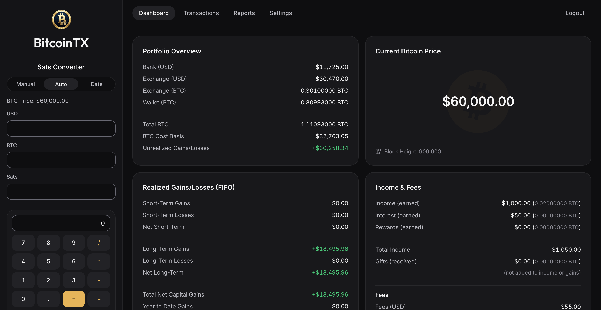
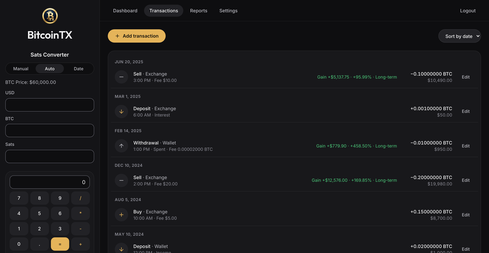
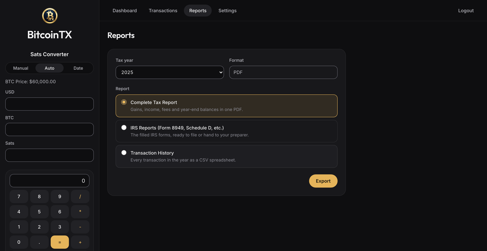
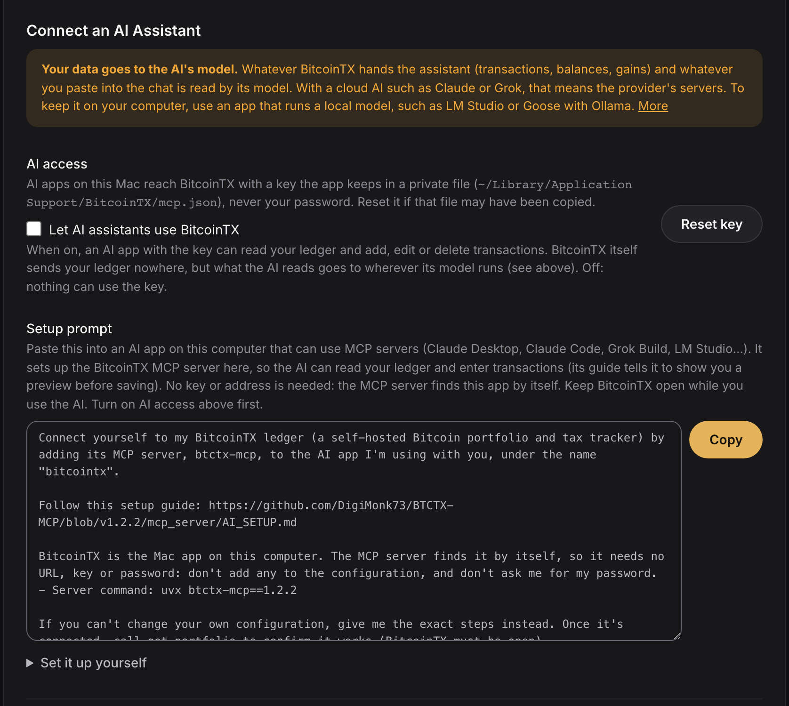

# BitcoinTX – Bitcoin Portfolio & Tax Tracker

A self-hosted Bitcoin portfolio tracker and tax report generator, with an
**MCP server** so an AI assistant can enter transactions for you. What changed
in each release: [docs/CHANGELOG.md](docs/CHANGELOG.md).

It tracks BTC and USD balances with **double-entry accounting**, computes
FIFO cost basis and capital gains per account, and prints IRS **Form 8949**
and **Schedule D**, including the Form 1099-DA boxes that start with tax year 2025.



| Transactions | Reports | Connect an AI Assistant |
|---|---|---|
|  |  |  |

<sub>Screenshots use a demo ledger.</sub>

## Features

- **Dashboard**: BTC holdings, USD balance, realized and unrealized gains
- **Transactions**: Deposit, Withdrawal, Transfer, Buy and Sell. Every edit
  recalculates the whole ledger, so backdated entries come out right.
- **FIFO lots per account**: a transfer keeps each lot's acquisition date and basis
- **Reports**: Form 8949 and Schedule D (filled, flattened PDFs), a complete
  tax report, and transaction history (PDF/CSV). When your broker's 1099-DA
  says something different for a sale, record that on the transaction and the
  right Form 8949 box follows.
- **Imports**: River CSV export, generic CSV (into an empty ledger), and the
  AI route below
- **AI entry (MCP)**: paste an exchange email or a wallet history, or type
  "moved 0.05 BTC to my Coldcard yesterday, fee 2k sats". The assistant
  previews the rows (duplicate check, fair market value, resulting gains) and
  saves them once you confirm. Use a local model if your data must stay on
  your computer ([below](#connect-an-ai-mcp)).
- **Ledger Review** (Settings): a read-only list of saved entries worth a
  second look, including every figure a recalculation would change
- **Stored price history**: past-day BTC prices are stored locally and
  stored days work offline. A missing day is filled by one download of about
  1,000 days, so most lookups don't reach an outside service at all; if that
  download fails, BitcoinTX asks for the single day. Turn Live data off to
  send none
- **Privacy & Network** (Settings): turn live data off, use your own mempool
  server, or send outside requests through a proxy such as Tor
- **Tax timezone** (Settings): decides which tax year a late-night Dec 31
  transaction lands in, the dates on Form 8949, and when a lot turns long-term
- **Encrypted backup/restore**, single-user login

## Install

Every [release](https://github.com/DigiMonk73/BTCTX-MCP/releases/latest) has
a macOS app, a StartOS package and a Docker image.

### macOS app

Download `BitcoinTX-macOS.dmg` from the latest release and drag BitcoinTX to
Applications. The app is not signed by Apple: the first time, Control-click
it and choose **Open**; on macOS 15 or later, open it once, then go to
**System Settings → Privacy & Security** and click **Open Anyway**. To build
it yourself: `./desktop/build-mac.sh`.

See [docs/MACOS_DESKTOP_APP.md](docs/MACOS_DESKTOP_APP.md). The app keeps its
data in `~/Library/Application Support/BitcoinTX`. While it's open it serves
its window from `http://127.0.0.1:8765`, which is also the address the MCP
server uses.

### Docker

```bash
docker run -d -p 8080:80 -v btctx-data:/data ghcr.io/digimonk73/btctx-mcp:latest
# open http://localhost:8080
```

Images are amd64 and arm64; pin a version with `:vX.Y.Z`. To build it
yourself: `docker build -t btctx .`

### StartOS

Download `btctx.s9pk` from the latest release and upload it in StartOS under
**Sideload**. See [startos/README.md](startos/README.md).

### From source

Requires Python 3.10+ and Node.js 20+.

```bash
pip install -r backend/requirements.txt
(cd frontend && npm ci && npm run build)
uvicorn backend.main:app --port 8000     # open http://localhost:8000
```

A `.env` file is optional; see [.env.example](.env.example).

### First login

A fresh install starts with the account `admin` / `password`. The first
screen lets you claim it with your own username and password. Do that before
you expose the app on a network.

## Connect an AI (MCP)

In BitcoinTX, open **Settings → Connect an AI Assistant**, copy the setup
prompt and paste it into your AI app (Claude Code, Claude Desktop, Grok Build
or any app that runs MCP servers on your computer). The AI sets itself up
following [mcp_server/AI_SETUP.md](mcp_server/AI_SETUP.md). The MCP server
uses an **AI key**, never your password. With the Mac app no key or address
goes anywhere: the app writes a private key file the MCP server reads by
itself. Or by hand, for the Mac app (Settings gives the same command):

```bash
claude mcp add --scope user bitcointx -- \
  uvx --from "git+https://github.com/DigiMonk73/BTCTX-MCP.git@main#subdirectory=mcp_server" btctx-mcp
```

The MCP server comes from this repo's `main` branch, which holds released
code only, so it updates itself when your AI app restarts, and it tells you
when it and your BitcoinTX are different versions.

Docker and StartOS use `BTCTX_URL` and `BTCTX_AI_KEY` instead: create the key
in the same Settings section (it's shown once) and paste it into your AI app's
configuration yourself, not into the chat.

[mcp_server/README.md](mcp_server/README.md) covers the Claude Desktop
config, Docker and StartOS addresses, TLS options, and example prompts.

**Privacy: the AI's model sees your ledger.** Once connected, the model reads
what the tools return (transactions, balances, cost basis, gains) and whatever
you paste. With a cloud AI (Claude, Grok and most others) that goes to the
provider's servers. To keep it on your computer, use an app that runs a local
model, such as [LM Studio](https://lmstudio.ai/) or
[Goose](https://goose-docs.ai/) with [Ollama](https://ollama.com/), or use a
cloud AI only with a test ledger. Setup for local models:
[mcp_server/README.md](mcp_server/README.md#privacy-cloud-or-local-model).

- **Optional.** Nothing AI-related runs until you add the MCP server to an AI
  app, and you choose which app and model.
- **BitcoinTX sends your ledger nowhere itself.** The MCP server talks only to
  your BitcoinTX; the model sees what the tools return.
- **Off by default.** The key works only after you turn on **Settings →
  Connect an AI Assistant → Let AI assistants use BitcoinTX**; turn it off to
  stop the AI.
- **What the key can do:** read the ledger, add, change or delete single
  entries, and make a backup copy on the server. It can't log in, change your
  password, restore a backup, import files or delete everything. In the Mac
  app it works only from that Mac; on Docker and StartOS you can revoke it or
  make a new one in Settings at any time.

**Set up an AI with Docker or StartOS before AI keys existed?** Your AI app's
settings file holds your BitcoinTX password in plain text, and BitcoinTX no
longer accepts it for AI access. (1) In **Settings → Connect an AI
Assistant**, turn on AI access and create an AI key; (2) in your AI app's
settings, replace `BTCTX_PASSWORD` (and `BTCTX_USERNAME`) with `BTCTX_AI_KEY`
set to that key, and delete the password; (3) change your BitcoinTX password
(Settings → Reset Username & Password), or on StartOS run **Reset Login
Credentials**, because the old one sat in that file. Mac app users: nothing
to do.

## Upgrading

1. Download an encrypted backup (Settings → Backup & Restore).
2. Start the new version. It upgrades the database automatically and keeps a
   copy of the old one in a `backups` folder next to it.
3. Open **Settings → Ledger Review**. It lists every figure a recalculation
   would change, old → new, without changing anything.
4. Click **Settings → Recalculate Ledger** when you agree.
5. Check your **Tax Timezone** in Settings.

From v0.7 or earlier, transfer fees, sale proceeds and the one-year holding
period are calculated differently; from before v0.9.2, withdrawal fees and
Lost withdrawals are. Either way, stored gains can change. The
[CHANGELOG](docs/CHANGELOG.md) lists what changes existing figures in each
release.

## Yearly IRS forms

`python scripts/irs_new_year.py 2026` downloads the year's final Form 8949
and Schedule D, checks every field the app fills, and runs the form tests. A
scheduled GitHub workflow flags when new forms are published. See
[docs/IRS_ANNUAL_FORM_UPDATE.md](docs/IRS_ANNUAL_FORM_UPDATE.md).

## Development

```bash
pip install -r backend/requirements.txt -r requirements-dev.txt ./mcp_server
make hooks        # pre-push gate: lint, static checks, fast tests, smoke test
make test         # full hermetic suite (temp DB, stubbed prices, no network)
make e2e          # click-through tests in real browsers (Playwright)
make check        # everything CI runs except the Docker/macOS builds
```

Testing guide: [docs/TESTING.md](docs/TESTING.md). Architecture and
conventions: [CLAUDE.md](CLAUDE.md).

| Layer | Tech |
|---|---|
| Frontend | React + TypeScript + Vite |
| Backend | FastAPI + SQLAlchemy + SQLite |
| PDFs | pypdf (IRS form filling), ReportLab (reports) |
| BTC prices | Stored daily history (bulk download from Bitstamp, Coinbase, Kraken; a single missing day from CoinGecko, Kraken, CoinDesk if that fails); live price from your mempool server or CoinGecko, Kraken, CoinDesk |
| Block height | Your mempool server, or Blockchain.info, Blockstream, mempool.space |
| AI | MCP server (Python `mcp` SDK, stdio) |

BitcoinTX doesn't give tax advice. Check its output before you file.

## License

MIT, see [LICENSE](LICENSE).
